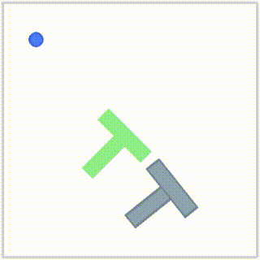

# ACT 复现：PushT 任务（LeRobot 框架）

复现 ACT（Action Chunking with Transformers, RSS 2023），在 PushT 任务上训练视觉运动策略，并与 Diffusion Policy 做对比。

## 演示视频

（模型在 PushT 仿真中自主推 T 块，成功 episode）

## 结果对比（同一 PushT 任务）

| 指标 | Diffusion Policy | ACT |
|---|---|---|
| 方法 | 扩散模型（生成式） | CVAE + Transformer（判别式） |
| 会议 | RSS 2023 | RSS 2023 |
| 成功率 | 93.2% | 16.0% |
| 模型参数 | 262M | 52M |
| 训练量 | 100 epoch（6.7万步） | 50000 步（62 epoch） |
| 训练 loss | 0.025 | 0.058 |
| 框架 | 哥伦比亚官方代码 | LeRobot 0.4.4 |

## 关键配置

- chunk_size=100, n_action_steps=10（闭环执行，及时纠正）
- torchcodec 0.7.0 + FFmpeg 5（视频解码）
- num_workers=1（避免多进程解码死锁）

## 踩坑记录

1. pyav 解码器偶发死循环 → 换 torchcodec
2. torchcodec 与 torch 版本不匹配 → 降级到 0.7.0
3. AV1 视频随机 seek 死锁 → 重编码 H.264 + 关键帧间隔 10

## 训练

完整训练日志见 train_act_v5.log

## 引用

ACT: Learning Fine-Grained Bimanual Manipulation with Low-Cost Hardware, RSS 2023
项目主页: https://tonyzhaozh.github.io/aloha/
